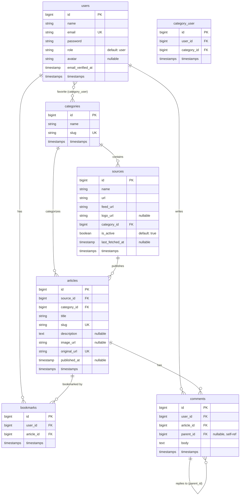

# VietFeed — Vietnamese News Aggregator

A Laravel 13 + MySQL news aggregator that auto-fetches Vietnamese news via RSS, with personalized feeds, bookmarks, threaded comments, and a full admin dashboard.

**Course**: Open Source Programming (PHP/Laravel) | **Team**: 4 members (solo coding) | **Timeline**: 1–2 weeks

---

## Proposed Changes

### Phase 1: Project Scaffold & Auth (Day 1)

#### [NEW] Laravel 13 Project
```bash
# Create project with Laravel Herd
composer create-project laravel/laravel VietFeed
cd VietFeed

# Install Breeze (Blade)
composer require laravel/breeze --dev
php artisan breeze:install blade

# No RSS package needed — using Laravel's built-in Http::get() + SimpleXML

# Install frontend deps
npm install
```

#### [MODIFY] `config/database.php`
- Configure MySQL connection for Laravel Herd

#### [MODIFY] `.env`
- Set `DB_DATABASE=vietfeed`, mail driver (Mailpit for dev), app name, app URL

#### [MODIFY] `app/Models/User.php`
- Implement `MustVerifyEmail` interface
- Add `role` to `$fillable`
- Add `$casts` for role as enum/string
- Add helper methods: `isAdmin()`, `isUser()`
- Add relationships: `bookmarks()`, `comments()`, `favoriteCategories()`

#### [NEW] `app/Http/Middleware/AdminMiddleware.php`
- Check `auth()->user()->isAdmin()`, abort 403 if not
- Register in `bootstrap/app.php` as `'admin'` alias

#### [MODIFY] Auth views (Breeze-generated)
- Restyle all auth views (login, register, forgot-password, reset-password, verify-email) with Bootstrap 5 + custom VietFeed theme

---

### Phase 2: Database Schema & Models (Day 1–2)

#### [NEW] Migration: `create_categories_table`
```
categories
├── id (bigIncrements)
├── name (string) — e.g., "Công nghệ"
├── slug (string, unique) — e.g., "cong-nghe"
└── timestamps
```

#### [NEW] Migration: `create_sources_table`
```
sources
├── id (bigIncrements)
├── name (string) — e.g., "VnExpress - Công nghệ"
├── url (string) — e.g., "https://vnexpress.net"
├── feed_url (string) — e.g., "https://vnexpress.net/rss/cong-nghe.rss"
├── logo_url (string, nullable)
├── category_id (foreignId → categories)
├── is_active (boolean, default true)
├── last_fetched_at (timestamp, nullable)
└── timestamps
```

#### [NEW] Migration: `create_articles_table`
```
articles
├── id (bigIncrements)
├── source_id (foreignId → sources)
├── category_id (foreignId → categories)
├── title (string)
├── slug (string, unique)
├── description (text, nullable)
├── image_url (string, nullable)
├── original_url (string, unique) — dedup key
├── published_at (timestamp, nullable)
└── timestamps
```

#### [NEW] Migration: `create_bookmarks_table`
```
bookmarks
├── id (bigIncrements)
├── user_id (foreignId → users)
├── article_id (foreignId → articles)
├── timestamps
└── unique([user_id, article_id])
```

#### [NEW] Migration: `create_comments_table`
```
comments
├── id (bigIncrements)
├── user_id (foreignId → users)
├── article_id (foreignId → articles)
├── parent_id (foreignId → comments, nullable) — for threading
├── body (text)
└── timestamps
```

#### [NEW] Migration: `create_category_user_table`
```
category_user (pivot)
├── id (bigIncrements)
├── user_id (foreignId → users)
├── category_id (foreignId → categories)
└── timestamps
```

#### [MODIFY] Migration: `create_users_table` (or add column migration)
- Add `role` column: `string, default 'user'`
- Add `avatar` column: `string, nullable`

#### [NEW] Eloquent Models
| Model | Key Relationships |
|-------|-------------------|
| `Category` | `hasMany(Source)`, `hasMany(Article)`, `belongsToMany(User, 'category_user')` |
| `Source` | `belongsTo(Category)`, `hasMany(Article)` |
| `Article` | `belongsTo(Source)`, `belongsTo(Category)`, `hasMany(Comment)`, `hasMany(Bookmark)`, `getReadingTimeAttribute()` |
| `Bookmark` | `belongsTo(User)`, `belongsTo(Article)` |
| `Comment` | `belongsTo(User)`, `belongsTo(Article)`, `belongsTo(Comment, 'parent_id')` as `parent`, `hasMany(Comment, 'parent_id')` as `replies` |

---

### Phase 3: RSS Feed Aggregation (Day 2–3)

#### [NEW] `app/Console/Commands/FetchFeeds.php`
- Artisan command: `feeds:fetch`
- Loop through all active sources (`Source::where('is_active', true)`)
- **No external package** — use Laravel's native `Http::get($source->feed_url)` + PHP's `SimpleXML`:
  ```php
  $response = Http::timeout(15)->get($source->feed_url);
  $xml = simplexml_load_string($response->body(), 'SimpleXMLElement', LIBXML_NOCDATA);
  foreach ($xml->channel->item as $item) {
      Article::updateOrCreate(
          ['original_url' => (string) $item->link],
          [
              'title' => (string) $item->title,
              'slug' => Str::slug($item->title),
              'description' => strip_tags((string) $item->description),
              'image_url' => $this->extractImage($item),
              'source_id' => $source->id,
              'category_id' => $source->category_id,
              'published_at' => Carbon::parse((string) $item->pubDate),
          ]
      );
  }
  ```
- `extractImage()` helper: check `<enclosure>`, `<media:content>`, or regex `` from description
- Wrap each source fetch in `try/catch` — log failures, continue to next source
- Update `source->last_fetched_at` on success
- Log summary: `"Fetched {$new} new, {$updated} updated from {$source->name}"`

#### [MODIFY] `routes/console.php` (or `app/Console/Kernel.php`)
- Register schedule: `Schedule::command('feeds:fetch')->everyThirtyMinutes()`

#### [NEW] `database/seeders/CategorySeeder.php`
Seed 8 categories:
| name | slug |
|------|------|
| Thời sự | thoi-su |
| Thế giới | the-gioi |
| Kinh doanh | kinh-doanh |
| Công nghệ | cong-nghe |
| Thể thao | the-thao |
| Giải trí | giai-tri |
| Sức khỏe | suc-khoe |
| Giáo dục | giao-duc |

#### [NEW] `database/seeders/SourceSeeder.php`
Seed ~20–30 source entries (5-8 sites × 3-4 category-specific RSS feeds each):
- VnExpress: `/rss/thoi-su.rss`, `/rss/the-gioi.rss`, `/rss/cong-nghe.rss`, etc.
- Tuổi Trẻ, Thanh Niên, Dân Trí, VietNamNet, Zing News, Nhân Dân, Lao Động

#### [NEW] `database/seeders/UserSeeder.php`
- 1 Admin: `admin@vietfeed.com` / `password`, role=admin
- 3 Users: `user1@vietfeed.com`, etc., role=user

---

### Phase 4: Public-Facing Controllers & Views (Day 3–5)

#### [NEW] `app/Http/Controllers/HomeController.php`
- `index()`: Magazine layout homepage
  - If authenticated + has favorite categories → personalized "For You" feed
  - Featured article: latest or most bookmarked
  - Hero grid: 1 large + 3 small articles
  - Card grid below with **infinite scroll** (AJAX endpoint for loading more) — **homepage only**
  - Trending sidebar: top 5 most bookmarked articles this week
  - **Skeleton loading**: show animated placeholder cards while AJAX content loads

#### [NEW] `app/Http/Controllers/ArticleController.php`
- `index()`: All articles list, filtered by category/source, **standard pagination** (`->paginate(12)`), searchable
- `show($slug)`: Article detail page — summary, image, metadata, "Read Full Article" CTA, bookmark toggle, threaded comments

#### [NEW] `app/Http/Controllers/CategoryController.php`
- `show($slug)`: Articles filtered by category, **standard pagination**

#### [NEW] `app/Http/Controllers/BookmarkController.php`
- `index()`: User's bookmarks page (auth required)
- `toggle(Request $request)`: AJAX endpoint — create or delete bookmark, return JSON

#### [NEW] `app/Http/Controllers/CommentController.php`
- `store(Request $request, Article $article)`: Create comment (or reply if `parent_id` set)
- `update(Request $request, Comment $comment)`: Edit own comment
- `destroy(Comment $comment)`: Delete own comment (or any if admin)

#### [NEW] `app/Http/Controllers/SearchController.php`
- `index(Request $request)`: `WHERE LIKE` on title + description, with category/source filters, **standard pagination** — no infinite scroll here
- `liveSearch(Request $request)`: AJAX endpoint returning JSON for navbar search with debounce (300ms), **skeleton dropdown** while loading

#### [NEW] `app/Http/Controllers/ProfileController.php` (extend Breeze)
- `updatePreferences(Request $request)`: Save favorite categories (sync pivot)

#### [NEW] `app/Http/Controllers/OnboardingController.php`
- `showInterests()`: After registration, show "Pick your interests" page
- `saveInterests(Request $request)`: Save selected categories, redirect to homepage

#### Blade Views Structure
```
resources/views/
├── layouts/
│   ├── app.blade.php          — main layout (navbar, footer, dark mode)
│   └── admin.blade.php        — admin layout (sidebar nav)
├── components/
│   ├── article-card.blade.php — reusable article card
│   ├── article-hero.blade.php — large hero article card
│   ├── comment.blade.php      — single comment (recursive for threading)
│   ├── skeleton-card.blade.php — article card skeleton placeholder
│   ├── skeleton-hero.blade.php — hero grid skeleton placeholder
│   ├── skeleton-search.blade.php — live search dropdown skeleton
│   ├── toast.blade.php        — toast notification component
│   └── search-bar.blade.php   — navbar live search
├── home/
│   └── index.blade.php        — magazine homepage
├── articles/
│   ├── index.blade.php        — article listing
│   └── show.blade.php         — article detail
├── categories/
│   └── show.blade.php         — category filtered view
├── bookmarks/
│   └── index.blade.php        — user's bookmarks
├── search/
│   └── index.blade.php        — search results
├── onboarding/
│   └── interests.blade.php    — pick your interests
├── profile/
│   └── edit.blade.php         — extended profile (avatar, preferences)
├── errors/
│   ├── 404.blade.php          — custom 404
│   └── 500.blade.php          — custom 500
└── auth/                      — restyled Breeze views
```

---

### Phase 5: Admin Dashboard & CRUD (Day 5–7)

#### [NEW] `app/Http/Controllers/Admin/DashboardController.php`
- `index()`: Dashboard with stats
  - Summary cards: total articles, users, comments, bookmarks (with trend vs. last week)
  - Chart.js charts:
    - Articles fetched over time (line/area, last 30 days)
    - Articles per category (donut)
    - Articles per source (horizontal bar)
    - New user registrations over time (line)
    - Most bookmarked articles (top 10 list)
  - Recent activity feed (latest comments, new users, latest articles)
  - Source health status (last fetch time per source, active/inactive badge)

#### [NEW] `app/Http/Controllers/Admin/SourceController.php`
- Full resource CRUD for sources
- `StoreSourceRequest` / `UpdateSourceRequest` Form Request classes

#### [NEW] `app/Http/Controllers/Admin/CategoryController.php`
- Full resource CRUD for categories
- `StoreCategoryRequest` / `UpdateCategoryRequest` Form Request classes

#### [NEW] `app/Http/Controllers/Admin/ArticleController.php`
- Full resource CRUD for articles (admin can edit/delete fetched articles)
- Bulk actions: delete selected

#### [NEW] `app/Http/Controllers/Admin/CommentController.php`
- List all comments, delete any (moderate)

#### [NEW] `app/Http/Controllers/Admin/UserController.php`
- List users, edit roles, delete users

#### Admin Blade Views
```
resources/views/admin/
├── dashboard.blade.php
├── sources/
│   ├── index.blade.php
│   ├── create.blade.php
│   ├── edit.blade.php
│   └── show.blade.php
├── categories/
│   ├── index.blade.php
│   ├── create.blade.php
│   └── edit.blade.php
├── articles/
│   ├── index.blade.php
│   ├── edit.blade.php
│   └── show.blade.php
├── comments/
│   └── index.blade.php
└── users/
    ├── index.blade.php
    └── edit.blade.php
```

---

### Phase 6: Routes (Day 3, refined throughout)

#### [MODIFY] `routes/web.php`
```php
// Public routes
Route::get('/', [HomeController::class, 'index'])->name('home');
Route::get('/articles', [ArticleController::class, 'index'])->name('articles.index');
Route::get('/articles/{slug}', [ArticleController::class, 'show'])->name('articles.show');
Route::get('/categories/{slug}', [CategoryController::class, 'show'])->name('categories.show');
Route::get('/sources/{source}', [SourceController::class, 'show'])->name('sources.show');
Route::get('/search', [SearchController::class, 'index'])->name('search');
Route::get('/api/live-search', [SearchController::class, 'liveSearch'])->name('search.live');

// Auth-required routes
Route::middleware(['auth', 'verified'])->group(function () {
    Route::get('/bookmarks', [BookmarkController::class, 'index'])->name('bookmarks.index');
    Route::post('/bookmarks/toggle', [BookmarkController::class, 'toggle'])->name('bookmarks.toggle');
    Route::post('/articles/{article}/comments', [CommentController::class, 'store'])->name('comments.store');
    Route::put('/comments/{comment}', [CommentController::class, 'update'])->name('comments.update');
    Route::delete('/comments/{comment}', [CommentController::class, 'destroy'])->name('comments.destroy');
    Route::get('/onboarding/interests', [OnboardingController::class, 'showInterests'])->name('onboarding.interests');
    Route::post('/onboarding/interests', [OnboardingController::class, 'saveInterests'])->name('onboarding.interests.save');
    Route::put('/profile/preferences', [ProfileController::class, 'updatePreferences'])->name('profile.preferences');
});

// API routes for AJAX
Route::middleware(['auth'])->prefix('api')->group(function () {
    Route::get('/articles', [HomeController::class, 'loadMore'])->name('api.articles.load');
});

// Admin routes
Route::middleware(['auth', 'admin'])->prefix('admin')->name('admin.')->group(function () {
    Route::get('/dashboard', [DashboardController::class, 'index'])->name('dashboard');
    Route::resource('sources', Admin\SourceController::class);
    Route::resource('categories', Admin\CategoryController::class);
    Route::resource('articles', Admin\ArticleController::class);
    Route::resource('comments', Admin\CommentController::class)->only(['index', 'destroy']);
    Route::resource('users', Admin\UserController::class)->only(['index', 'edit', 'update', 'destroy']);
});
```

---

### Phase 7: UI/UX Design System — "Editorial Modernism" (Day 1, refined throughout)

#### [NEW] `resources/css/app.css` (or SCSS)
Design system tokens and global styles:

**Design Philosophy:** Magazine editorial layout with classic typographic hierarchy, dark-mode-first, monochromatic palette with a single red accent. Every interaction should feel deliberate and refined.

**Color Palette — Monochromatic + Single Accent:**
```css
/* Dark mode (DEFAULT) */
[data-theme="dark"] {
  --bg:           #0B0B0F;
  --surface:      #141418;
  --surface-alt:  #1C1C22;
  --border:       #2A2A32;
  --text:         #E8E8EC;
  --text-muted:   #8888A0;
  --accent:       #E63946;    /* Vietnamese red — single accent color */
  --accent-hover: #FF4D5A;
  --glass-bg:     rgba(20, 20, 24, 0.72);
  --glass-border: rgba(255, 255, 255, 0.08);
  --skeleton-shine: rgba(255, 255, 255, 0.06);
}

/* Light mode */
[data-theme="light"] {
  --bg:           #F5F5F0;
  --surface:      #FFFFFF;
  --surface-alt:  #FAFAF7;
  --border:       #E0E0D8;
  --text:         #1A1A1F;
  --text-muted:   #6B6B78;
  --accent:       #D62839;
  --accent-hover: #E63946;
  --glass-bg:     rgba(255, 255, 255, 0.72);
  --glass-border: rgba(0, 0, 0, 0.06);
  --skeleton-shine: rgba(0, 0, 0, 0.04);
}
```

**Typography — Dual-Font System:**
- **Headings**: `Playfair Display` (Google Fonts) — serif, oversized, editorial weight
  - Hero title: `clamp(2.4rem, 5vw, 3.6rem)`, font-weight 700
  - Article card title: `1.25rem`, font-weight 600
  - Section headings: `1.5rem`, font-weight 700, letter-spacing `-0.02em`
- **Body / UI**: `Be Vietnam Pro` (Google Fonts) — sans-serif, optimized for Vietnamese
  - Body text: `15px`, line-height 1.7, font-weight 400
  - Captions/meta: `13px`, font-weight 400, color `var(--text-muted)`
  - Buttons/labels: `14px`, font-weight 500

**Glassmorphism Navbar:**
```css
.navbar {
  position: sticky;
  top: 0;
  z-index: 1000;
  background: var(--glass-bg);
  backdrop-filter: blur(16px) saturate(180%);
  -webkit-backdrop-filter: blur(16px) saturate(180%);
  border-bottom: 1px solid var(--glass-border);
  transition: background 0.3s ease, box-shadow 0.3s ease;
}
.navbar.scrolled {
  box-shadow: 0 4px 30px rgba(0, 0, 0, 0.12);
}
```

**Component Styles:**

- `.article-card` — subtle hover lift micro-interaction:
  ```css
  .article-card {
    border-radius: 12px;
    background: var(--surface);
    border: 1px solid var(--border);
    transition: transform 0.3s cubic-bezier(0.25, 0.46, 0.45, 0.94),
                box-shadow 0.3s ease;
  }
  .article-card:hover {
    transform: translateY(-4px);
    box-shadow: 0 12px 40px rgba(0, 0, 0, 0.15);
  }
  ```

- `.hero-grid` — CSS Grid for magazine layout (60/40 split):
  ```css
  .hero-grid {
    display: grid;
    grid-template-columns: 1.4fr 1fr;
    gap: 1.25rem;
  }
  ```

- `.category-tabs` — sticky tabs with smooth underline transition:
  ```css
  .category-tabs {
    position: sticky;
    top: 64px; /* below navbar */
    z-index: 100;
    background: var(--glass-bg);
    backdrop-filter: blur(12px);
    border-bottom: 1px solid var(--border);
    overflow-x: auto;
    scrollbar-width: none;
  }
  .category-tab {
    position: relative;
    padding: 0.75rem 1.25rem;
    color: var(--text-muted);
    font-family: 'Be Vietnam Pro', sans-serif;
    font-weight: 500;
    transition: color 0.2s ease;
  }
  .category-tab::after {
    content: '';
    position: absolute;
    bottom: 0;
    left: 50%;
    width: 0;
    height: 2px;
    background: var(--accent);
    transition: width 0.3s ease, left 0.3s ease;
  }
  .category-tab:hover,
  .category-tab.active {
    color: var(--accent);
  }
  .category-tab.active::after {
    width: 100%;
    left: 0;
  }
  ```

- `.trending-sidebar` — bordered list with numbered items, monochromatic
- Toast animations (slide in from top-right, auto-dismiss with progress bar)

**Scroll-Triggered Animations:**
```css
/* Fade-in on scroll */
.fade-in {
  opacity: 0;
  transform: translateY(24px);
  transition: opacity 0.6s ease, transform 0.6s ease;
}
.fade-in.visible {
  opacity: 1;
  transform: translateY(0);
}

/* Staggered card reveal — each card delayed by 100ms × index */
.card-stagger:nth-child(1) { transition-delay: 0ms; }
.card-stagger:nth-child(2) { transition-delay: 100ms; }
.card-stagger:nth-child(3) { transition-delay: 200ms; }
/* ... generated dynamically via JS for loaded content */
```

**Micro-Interactions:**

- `.bookmark-btn` — heart icon fill with pop animation:
  ```css
  .bookmark-btn .icon {
    transition: transform 0.25s cubic-bezier(0.175, 0.885, 0.32, 1.275);
  }
  .bookmark-btn.active .icon {
    color: var(--accent);
    transform: scale(1.2);
    animation: bookmark-pop 0.4s ease;
  }
  @keyframes bookmark-pop {
    0%   { transform: scale(1); }
    50%  { transform: scale(1.35); }
    100% { transform: scale(1.2); }
  }
  ```

- `.dark-mode-toggle` — sun/moon icon rotation swap:
  ```css
  .dark-mode-toggle .icon {
    transition: transform 0.4s ease, opacity 0.3s ease;
  }
  .dark-mode-toggle[data-mode="dark"] .sun  { opacity: 0; transform: rotate(-90deg) scale(0); }
  .dark-mode-toggle[data-mode="dark"] .moon { opacity: 1; transform: rotate(0) scale(1); }
  .dark-mode-toggle[data-mode="light"] .sun  { opacity: 1; transform: rotate(0) scale(1); }
  .dark-mode-toggle[data-mode="light"] .moon { opacity: 0; transform: rotate(90deg) scale(0); }
  ```

**Skeleton Loading Styles:**
- `.skeleton` — base class with shimmer matching `var(--surface)` / `var(--skeleton-shine)` tokens
- `.skeleton-card` — matches `.article-card` dimensions: image placeholder (16:9 ratio), 3 text lines (varying widths: 100%, 80%, 60%)
- `.skeleton-hero` — matches hero grid layout: large card left + 3 small cards stacked right
- `.skeleton-text` — single line placeholder with rounded corners
- `.skeleton-avatar` — circular placeholder for comment author avatars
- `.skeleton-search-item` — matches live search dropdown result item
- `@keyframes shimmer` — smooth left-to-right gradient sweep

**Where skeletons appear (AJAX-only — Blade SSR pages render content on first paint, no skeleton needed):**
| Trigger | Skeleton shown |
|---------|----------------|
| Infinite scroll loading next batch | 3 skeleton cards appended at bottom |
| Live search typing (debounce wait) | 3-4 skeleton items in dropdown |
| Bookmark page (if loaded via AJAX) | Grid of skeleton cards |
| Comment section (if lazy-loaded) | 2-3 skeleton comment blocks |

**Bootstrap 5 Customization:**
- Override Bootstrap SCSS variables or use CSS custom properties
- Card component overrides (remove default border, use `var(--border)`)
- Override `$body-bg`, `$body-color`, `$font-family-base` to match design tokens

#### [NEW] `resources/js/app.js`
- **Dark mode toggle** — read/write `localStorage`, toggle `data-theme` on `<html>`, rotate sun/moon icon
- **Bookmark toggle** — fetch POST with CSRF, pop animation on icon, update count
- **Live search** with debounce (300ms) + skeleton dropdown while waiting
- **Infinite scroll** — **homepage only** (IntersectionObserver, fetch next page, show skeleton cards → replace with real cards)
- **Scroll-triggered fade-in** — IntersectionObserver on `.fade-in` elements, add `.visible` class when 15% in viewport
- **Staggered card reveal** — on new batch load, apply incremental `transition-delay` per card
- **Sticky navbar scroll detection** — add `.scrolled` class after 50px scroll for enhanced glass shadow
- **Toast notification system**
- **Comment reply toggle** — show/hide reply form with slide animation
- **Skeleton swap utility** — `showSkeleton(container)` / `replaceSkeleton(container, html)`

---

### Phase 8: Polish & Final Touches (Day 7–10)

#### [MODIFY] README.md
Professional README with:
- Project description & screenshots
- Features list
- Tech stack
- Prerequisites & setup instructions
- Database schema (mermaid diagram)
- Team credits & course info
- License

#### [NEW] Custom error pages
- `resources/views/errors/404.blade.php` — styled with VietFeed theme
- `resources/views/errors/500.blade.php` — styled with VietFeed theme

#### Footer component
- Team credits, course info, GitHub link

#### Reading time calculation
- `Article` model accessor: `getReadingTimeAttribute()` — estimate from description word count

#### Share buttons
- Article detail page: copy link, Facebook, Twitter/X share URLs

---

## Database Schema Diagram



---

## Verification Plan

### Automated Setup
```bash
# One-command setup
php artisan migrate:fresh --seed && php artisan feeds:fetch
```

### Manual Verification Checklist
- [ ] Register new user → email verification flow works
- [ ] Onboarding: "Pick your interests" screen appears after registration
- [ ] Homepage shows personalized feed based on selected categories
- [ ] Magazine layout renders correctly (hero grid + card grid + sidebar)
- [ ] Dark/light mode toggle persists across page loads
- [ ] Search: keyword search returns relevant articles
- [ ] Search: AJAX live search in navbar works with debounce
- [ ] Category/source filtering works
- [ ] Infinite scroll loads more articles on homepage (skeleton cards shown while loading)
- [ ] Standard pagination works on search results, category pages, bookmarks (NO infinite scroll)
- [ ] Skeleton loading appears on: homepage load, infinite scroll, live search, bookmark page
- [ ] Bookmark toggle works via AJAX (no page reload)
- [ ] "My Bookmarks" page lists saved articles
- [ ] Comments: post, reply (threaded), edit own, delete own
- [ ] Admin: dashboard loads with all charts and stats
- [ ] Admin: CRUD sources, categories, articles
- [ ] Admin: moderate (delete) any comment
- [ ] Admin: manage users (view, edit role, delete)
- [ ] Non-admin cannot access `/admin/*` routes (403)
- [ ] Guest cannot bookmark or comment (redirected to login)
- [ ] RSS fetch command populates articles with real Vietnamese news
- [ ] Reading time displays on article cards
- [ ] Share buttons work on article detail page
- [ ] Custom 404/500 pages display correctly
- [ ] Mobile responsive (test at 375px, 768px, 1024px, 1440px)

### Demo Script
1. Show homepage as guest (magazine layout, trending sidebar)
2. Register new account → onboarding → pick interests
3. Homepage now shows personalized "For You" feed
4. Search for a topic, show live search + filtered results
5. Open an article → bookmark it → post a comment → reply to comment
6. Show "My Bookmarks" page
7. Toggle dark mode
8. Login as admin → show dashboard with charts
9. CRUD a source → fetch its RSS → show new articles appear
10. Moderate a comment → edit a user's role
11. Show mobile responsive design

---

## Priority Order (if time is tight)

> [!IMPORTANT]
> If you're running short on time, build in this order. Each tier adds features on top of the previous.

**Tier 1 — MVP (Days 1–5):** Project setup, auth, migrations, models, RSS fetch command, basic homepage with article listing, article detail page, basic search + pagination, admin CRUD for sources/categories/articles, basic styling with Bootstrap.

**Tier 2 — Core Features (Days 5–7):** Bookmarks (AJAX), comments (threaded), admin dashboard with stats/charts, category filtering, dark mode toggle, magazine layout.

**Tier 3 — Polish (Days 7–10):** Personalized feed + onboarding, AJAX live search, infinite scroll (homepage only), skeleton loading states, toast notifications, reading time, share buttons, custom error pages, README polish, responsive refinement.
